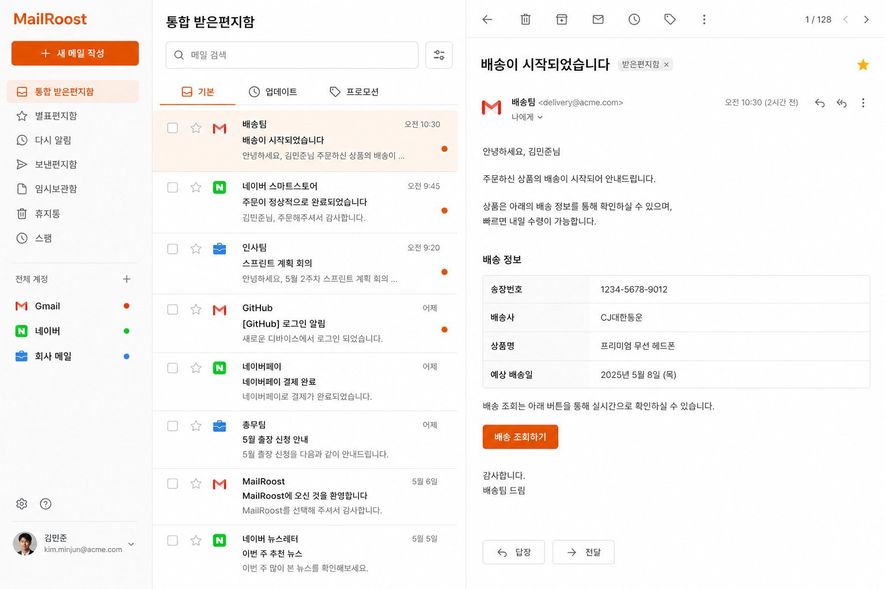
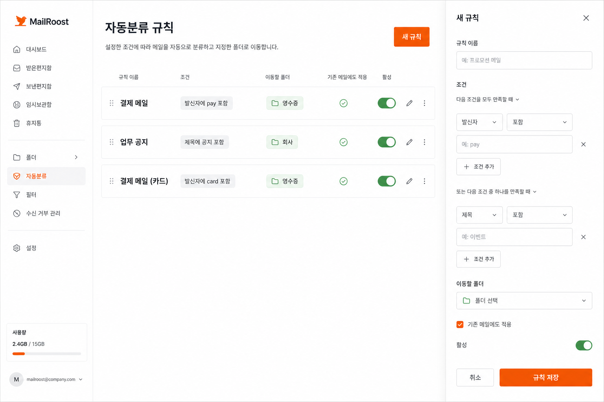
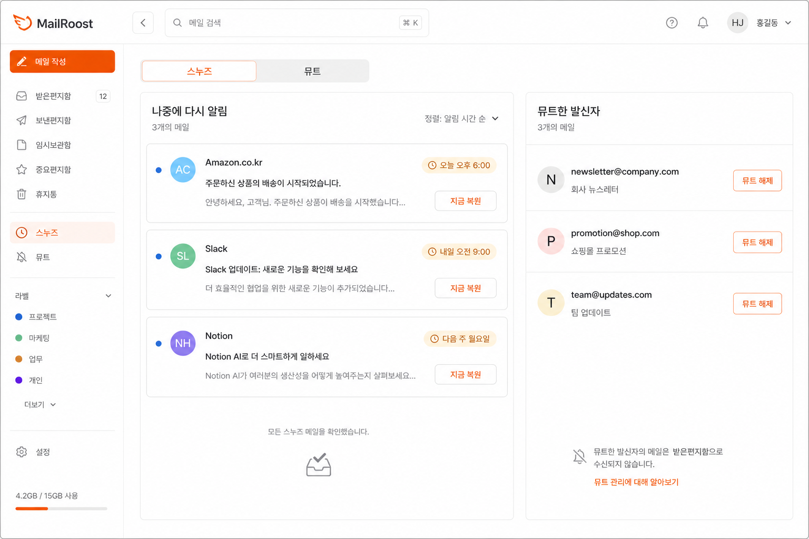
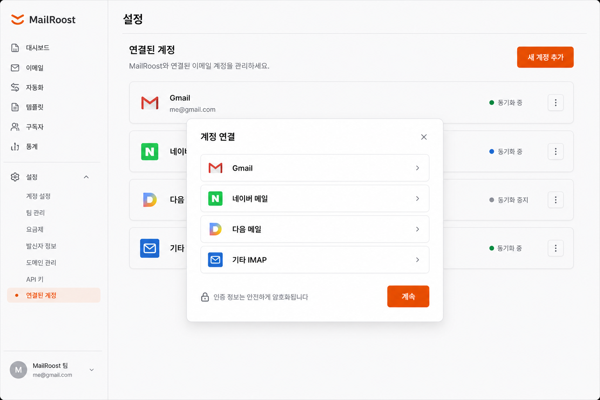

# MailRoost — 포트폴리오


> 여러 이메일 계정(Gmail · 네이버 · 다음 · 범용 IMAP)을 한 화면에서 보는 **개인용 웹메일 클라이언트**

---

## 개요

MailRoost는 흩어진 이메일 계정을 하나의 인터페이스에서 통합 관리하기 위해 직접 설계·개발한 풀스택 웹 애플리케이션입니다. 서버리스 엣지 컴퓨팅 플랫폼 위에서 동작하며, 별도 서버 운영 비용 없이 전 세계 어디서나 낮은 레이턴시로 접근할 수 있도록 구현했습니다.

---

## 기술 스택

| 영역 | 기술 |
|------|------|
| **Frontend** | React 19, TypeScript, Vite, Tailwind CSS |
| **Backend** | Cloudflare Workers, Hono |
| **상태 저장** | Cloudflare Durable Objects, Cloudflare KV |
| **메일 프로토콜** | Gmail API (OAuth2), IMAP (네이버·다음·범용) |
| **보안** | AES-GCM (자격증명 암호화), Web Crypto API |
| **푸시 알림** | Web Push (VAPID), Service Worker |
| **PWA** | Workbox, Web App Manifest |
| **배포** | Cloudflare Workers Builds (git push → 자동 배포) |

---

## 주요 기능

### 멀티 계정 통합
- Gmail, 네이버, 다음, 범용 IMAP 계정을 동시에 연결
- 계정별 색상 구분 및 순서 커스터마이징
- 통합 받은편지함 (계정 전체 메일을 하나의 타임라인으로)
- Google 로그인 프로필과 현재 로그인 계정 표시
- 같은 사용자로 연결된 로그인 이메일 간 연결 계정·주소록·임시보관함 공유
- 발신자 도메인을 기준으로 Gmail·네이버·Patreon 등 브랜드 아이콘 표시

### 메일 탐색 · 관리
- 읽음/안 읽음, 별표 표시와 중요 메일 전용 모아보기
- 계정별 휴지통 통합 조회, 복원, 개별·전체 비우기
- 보관함 및 사용자 정의 분류 메일함
- 브라우저 History API 기반 화면 상태 복원으로 새로고침·뒤로가기 시 현재 뷰 유지

### 자동분류 메일함
- 발신자 · 제목 키워드 기반 자동분류 규칙 생성
- 규칙 생성 시 서버에서 과거 메일(계정당 최대 200개)까지 소급 적용
- 수동 이동과 자동분류를 구분 추적해 사용자 선택 존중

### 스누즈 / 뮤트
- 특정 메일을 지정 시간까지 숨겼다가 자동 복원
- 발신자 단위 뮤트(이후 메일도 자동 처리)
- 스누즈된 메일 전용 뷰 제공

### 메일 작성 · 발송
- 받는 사람을 태그 형태로 추가하고 개별 수정·삭제
- 최근 수신 주소 자동완성과 별도 주소록 저장·삭제
- 참조(CC)·숨은 참조(BCC), 발신 계정 선택, 계정별 서명
- 서식 있는 HTML 에디터와 일반 텍스트 전환, 글자 크기·굵기·목록·링크 등 편집 도구
- 첨부파일 지원 (드래그&드롭, 이미지·PDF·텍스트 미리보기)
- 답장·전체 답장·전달 및 기존 첨부파일 전달
- 빠른 답장 템플릿 관리
- 임시보관함 자동 저장

### 검색 · 필터
- 전 계정 통합 검색
- 자주 쓰는 검색 조건을 필터로 저장

### UI/UX
- 다크 모드 + 시스템 테마 자동 연동
- 리사이징 가능한 메일 목록 / 본문 분할 패널
- 자석(snap) 기능이 있는 패널 구분선
- 메일 미선택 상태·홈 대시보드·전체 화면 작성 화면을 포함한 반응형 UI
- HTML 메일의 외부 링크 활성화와 CID 인라인 이미지·원격 이미지 표시 보정
- FOUC(Flash of Unstyled Content) 방지 처리

### 알림
- Gmail Pub/Sub 웹훅과 Web Push를 연계한 새 메일 브라우저 알림
- 앱 내 알림 센터와 읽음 처리
- 알림음 설정

---

## 주요 화면

| 통합 받은편지함 | 자동분류 규칙 |
|---|---|
|  |  |

| 스누즈·뮤트 | 계정 연결 설정 |
|---|---|
|  |  |

> 위 이미지는 실제 제품의 디자인 시스템과 기능 구성을 바탕으로 제작한 포트폴리오용 목업입니다.

---

## 아키텍처

```
브라우저 (React + Vite)
        │  REST API (Cookie 기반 세션)
        ▼
Cloudflare Workers (Hono 라우터)
        │
        ├── Gmail API ────────────── Google 서버
        ├── IMAP over fetch-connect ─ 네이버/다음/범용
        ├── Durable Objects ───────── 사용자별 메일 분류 상태
        └── Cloudflare KV ─────────── 세션 · 계정 · 암호화 자격증명
```

### 상태 설계 원칙

로그인 사용자의 분류 메일함·규칙·스누즈·뮤트·보관 상태(`MailOrgState`)는 사용자별 `MailOrgStore` Durable Object가 관리합니다. 모든 변경을 명령 단위 `applyOp` 호출로 전달하고 같은 사용자에 대한 요청을 직렬화해 동시 수정의 원자성을 확보했습니다.

세션, 연결 계정, 암호화된 자격증명, 주소록과 임시보관함 등은 Cloudflare KV에 저장합니다. 기존 KV 기반 `MailOrgState`는 최초 접근 시 Durable Object로 지연 마이그레이션되어 별도 일괄 이전 없이 기존 사용자 상태를 보존합니다.

---

## 기술적 도전과 해결

### 1. KV 동시성 레이스 (Lost-Update)
**문제**: 20초 자동 폴링, 여러 탭, 수동 새로고침이 겹치면 나중에 온 요청이 먼저 온 요청의 변경사항을 덮어쓰는 버그.

**해결**: 모든 상태 변경을 타입이 지정된 operation으로 표현하고 `mutateMailOrg`를 통해 사용자별 Durable Object의 단일 `applyOp` 호출로 위임. Cloudflare의 인스턴스별 요청 직렬화를 이용해 읽기·수정·저장을 하나의 경계 안에서 처리했습니다. 레거시 KV 데이터에는 지연 마이그레이션을 적용했습니다.

### 2. 눈에 안 보이는 구분자 버그
**문제**: 메일 식별 키에 U+0001 제어문자를 구분자로 사용했는데, 편집 과정에서 빈 문자열로 조용히 소실됨. `"x".indexOf("")`가 항상 0을 반환하는 JS 특성 때문에 분류 메일함 조회와 스누즈가 몇 달간 에러 없이 항상 빈 결과를 반환.

**해결**: 구분자 없는 접두사 대조 방식으로 키 파싱 로직 재설계. 코드베이스에 관련 원칙을 CLAUDE.md와 인시던트 문서로 명문화.

### 3. 보안 — IMAP 명령 인젝션 방지
**문제**: 사용자가 입력한 mailId가 IMAP 명령에 직접 사용되어 인젝션 공격 가능성 존재.

**해결**: mailId 포맷 검증 미들웨어 추가. 숫자 UID만 허용하거나 안전한 형식만 통과시키도록 라우트 레벨에서 차단.

### 4. 자격증명 암호화
**문제**: 계정 비밀번호 · OAuth 토큰이 Cloudflare KV에 평문으로 저장됨.

**해결**: AES-GCM 기반 `crypto.ts` 모듈 구현. 저장 시 암호화, 읽기 시 복호화. `enc:` 접두어로 암호화 여부를 판별해 기존 평문 데이터와 무중단 공존 (별도 마이그레이션 불필요).

### 5. 분류 규칙 소급 적용과 네이버 IMAP 호환성
**문제**: 새 자동분류 규칙을 만들어도 이미 받은 메일은 분류 메일함에 들어가지 않았습니다. 이를 해결하기 위해 서버 측 소급 적용 기능을 추가했지만, 네이버 계정에서는 발신자 규칙을 실행해도 일치하는 기존 메일이 0건으로 반환되는 문제가 남았습니다.

**발견**: 읽음 여부가 검색 범위를 제한하는지 먼저 점검했으나, 구현은 읽은 메일과 안 읽은 메일을 구분하지 않고 `INBOX` 전체를 대상으로 하고 있었습니다. 이후 실제 IMAP 검색 명령을 추적해, 발신자 규칙에도 `OR FROM "pay" OR SUBJECT "pay" TEXT "pay"`처럼 발신자·제목·본문을 한 번에 조회하는 복합 조건이 전송되고 있음을 확인했습니다. 이 중첩 `OR` 명령을 네이버 IMAP 서버가 안정적으로 처리하지 못해 오류 또는 빈 결과를 반환한 것이 원인이었습니다.

**해결**: `POST /api/rules/:id/apply`가 규칙의 필드(`from` 또는 `subject`)를 IMAP 검색 함수까지 전달하도록 변경했습니다. 발신자 규칙은 `FROM "pay"`, 제목 규칙은 `SUBJECT "pay"`처럼 단일 검색 기준으로 변환하고, 범용 통합 검색에서만 기존의 넓은 `OR` 검색을 유지했습니다. 또한 IMAP 검색 결과를 애플리케이션에서 다시 규칙과 대조해 서버별 검색 동작 차이로 인한 오분류를 방지했습니다.

**결과**: 읽음 여부와 무관하게 받은편지함 전체의 기존 메일을 검색하면서도 네이버 IMAP과 호환되는 소급 분류가 가능해졌습니다. 이 경험을 통해 표준 프로토콜을 사용하더라도 공급자별 명령 지원 차이를 고려해야 하며, 검색 의도를 가장 단순한 서버 명령으로 표현하고 애플리케이션 계층에서 한 번 더 검증하는 방어적 설계가 중요하다는 점을 확인했습니다.

### 6. 공급자별 HTML 메일 호환성
**문제**: 메일 본문의 `cid:` 인라인 이미지가 깨지거나, HTML 링크가 iframe sandbox 안에서 열리지 않는 문제가 있었습니다. 일반 텍스트 메일에 포함된 URL도 단순 문자열로 표시되었습니다.

**해결**: MIME 파트의 Content-ID와 첨부파일을 매핑하는 인라인 이미지 API를 추가하고, 렌더링 전에 HTML의 `cid:` URL을 안전한 내부 URL로 치환했습니다. 링크에는 새 창 대상과 `noopener noreferrer`를 강제하고 사용자 동작에 한해 외부 탐색을 허용했습니다. 일반 텍스트 본문에는 URL·메일 주소를 인식하는 링크 변환기를 적용했습니다.

### 7. 멀티 계정 발송 파이프라인
**문제**: Gmail API와 IMAP/SMTP 계정이 서로 다른 방식으로 HTML 본문, CC/BCC, 새 첨부파일과 전달 첨부파일을 처리해야 했습니다.

**해결**: 프론트엔드 작성 데이터를 공통 구조로 정규화하고 백엔드에서 MIME 메시지를 생성하도록 통합했습니다. 전달 첨부파일은 원본 계정에서 다시 가져오고, 새 파일은 Base64로 전달해 하나의 발송 요청에서 조합합니다. 발송 전 HTML은 서버에서 정제해 편집 기능과 보안을 함께 유지했습니다.

---

## 배포 · 운영

- **무중단 자동 배포**: `main` 브랜치 push → Cloudflare Workers Builds 자동 빌드 + 배포
- **로그 모니터링**: `wrangler tail --format json`으로 실시간 워커 로그 관찰
- **상태 디버깅**: KV CLI(`wrangler kv key get`)로 저장된 blob 직접 검사
- **운영 비용**: Cloudflare Workers 무료 티어 내에서 운영 (월 100,000 요청 무료)

---

## 디렉터리 구조

```
MailRoost/
├── frontend/          # React + Vite + Tailwind
│   ├── src/
│   │   ├── App.tsx               # 전역 상태 · 라우팅
│   │   ├── components/
│   │   │   ├── home/             # 통합 현황 대시보드
│   │   │   ├── mail/             # 메일 목록 · 상세 · 작성 · 첨부 미리보기
│   │   │   ├── cleanup/          # 자동분류 규칙 관리
│   │   │   ├── snoozed/          # 스누즈 뷰
│   │   │   ├── muted/            # 뮤트 뷰
│   │   │   ├── drafts/           # 임시보관함
│   │   │   ├── trash/            # 휴지통 조회 · 복원 · 비우기
│   │   │   ├── memo/             # 메모
│   │   │   └── settings/         # 설정
│   │   └── lib/api.ts            # REST API 클라이언트
│   └── public/
│       ├── og-image.png          # OG 이미지 (1200×630)
│       ├── mail-empty-roost.png   # 메일 미선택 상태 일러스트
│       └── pwa-*.png             # PWA 아이콘
└── backend/           # Cloudflare Workers + Hono
    └── src/
        ├── routes/               # 계정·메일·주소록·휴지통 등 API 모듈
        ├── durable/              # MailOrgStore Durable Object
        └── lib/
            ├── mailOrg.ts        # MailOrgState CRUD
            ├── crypto.ts         # AES-GCM 자격증명 암호화
            ├── imap.ts           # IMAP 통합 (네이버·다음·범용)
            ├── gmail.ts          # Gmail API 통합
            ├── session.ts        # 세션 관리
            └── webpush.ts        # Web Push 발송
```

---

## 회고

처음에는 단순히 "여러 계정을 한 화면에서 보고 싶다"는 개인적인 불편함에서 시작한 프로젝트입니다. 서버리스 환경의 특성(스테이트리스 Worker, KV의 동시성 제약, Durable Object의 직렬화)을 직접 설계하고 운영하면서 분산 시스템의 상태 관리, 보안(인젝션·암호화·HTML 정제), 공급자별 프로토콜 차이와 하위 호환성을 유지하며 기능을 확장하는 방법을 실전으로 익혔습니다.

특히 눈에 보이지 않는 제어문자 버그처럼 에러 없이 조용히 잘못된 결과를 반환하는 실패 모드는, 로그 기반 관찰 가능성과 방어적 코딩의 중요성을 체감하게 해준 경험이었습니다.
